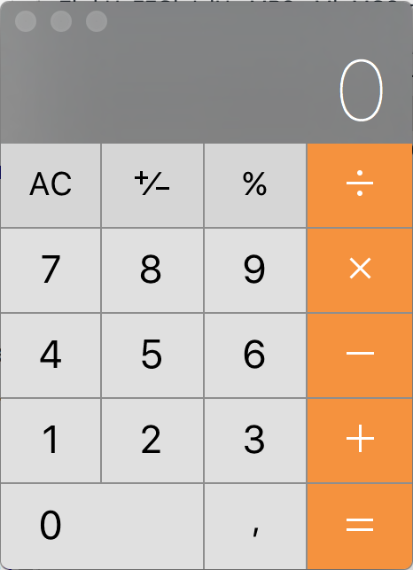

# Java Script Calculator
 ---

## This repo is created in order to develop skills in HTML / CSS and JavaScript 

To make something that could test skills and at the same time be useful, it was decided to create a basic calculator

About design, it was decided to make the same kind of calculator from MacOS (See picture below). The calculator works in a responsive way, so for screens wider that 700px it looks like the calculator of Mac OS (picture below) and in screens with less than 700px it looks like the calculator of iOS.

To see it live follow [this link.](https://abelroland.github.io/calcJS/)